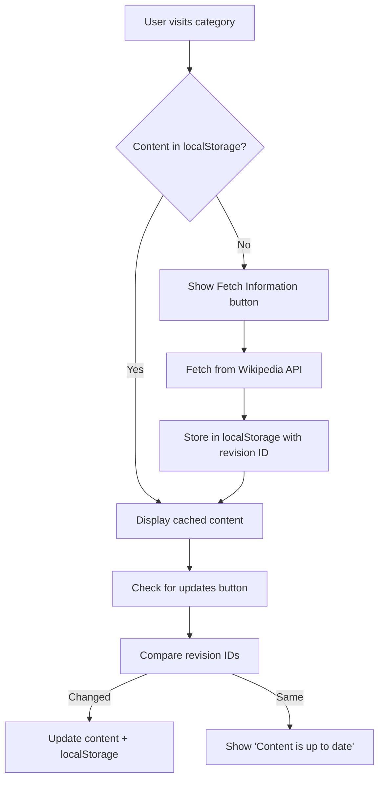

# Intelboard Community — Architecture

## Overview

Intelboard Community is a Wikipedia-style hierarchical knowledge platform with community features. Users can browse categorized knowledge, fetch content from Wikipedia, participate in forums, attend events, take quizzes, and chat with other members.

## Tech Stack

| Layer | Technology | Purpose |
|-------|-----------|---------|
| Framework | Next.js 16 (App Router) | SSR, routing, API routes |
| Language | TypeScript | Type safety across the stack |
| Auth | Firebase Authentication | Google Sign-In |
| Database | Firebase Firestore | Forums, events, quizzes, user profiles |
| Realtime | Firebase Realtime Database | Chat messaging |
| Search | Fuse.js | Client-side fuzzy search |
| Styling | CSS Modules + Vanilla CSS | Component-scoped + global design system |
| Content | Wikipedia REST API | On-demand category content |
| Storage | localStorage | Persistent Wikipedia content cache |

## Directory Structure

```
src/
├── app/                          # Next.js App Router pages
│   ├── layout.tsx                # Root layout (fonts, metadata)
│   ├── globals.css               # Design system (tokens, utilities)
│   ├── page.tsx                  # Landing page
│   ├── page.module.css
│   ├── category/[...slug]/       # Dynamic category pages
│   │   ├── page.tsx              # Category workspace (tabs)
│   │   └── category.module.css
│   ├── chat/                     # Real-time messaging
│   ├── contacts/                 # Contact management
│   └── search/                   # Search results
├── components/                   # Reusable UI components
│   ├── Header.tsx                # Global header (search, auth)
│   ├── Sidebar.tsx               # Category tree navigation
│   ├── ClientLayout.tsx          # Auth provider + layout wrapper
│   ├── ForumTab.tsx              # Discussion forum
│   ├── EventsTab.tsx             # Calendar & events
│   └── LearnTab.tsx              # Quizzes & learning
├── contexts/
│   └── AuthContext.tsx           # Firebase auth state management
├── data/
│   └── categories.ts            # Static category hierarchy + utilities
├── lib/
│   ├── firebase.ts              # Firebase initialization (conditional)
│   ├── firestore.ts             # Firestore CRUD helpers
│   ├── wikipedia.ts             # Wikipedia API client
│   ├── wikiStorage.ts           # localStorage persistence layer
│   ├── search.ts                # Fuse.js search wrapper
│   └── logger.ts                # Structured logging utility
└── __tests__/                   # Unit tests
```

## Data Flow



## Key Design Decisions

1. **localStorage over Firestore for Wikipedia cache** — No Firebase setup required, instant reads, works offline. Content is per-browser but that is acceptable since it's public Wikipedia data.

2. **Conditional Firebase initialization** — Firebase only initializes when valid API keys exist. This prevents build failures and allows the app to work without Firebase (categories, Wikipedia, search all work without it).

3. **Static category hierarchy** — Categories are defined in code, not in a database. This ensures fast navigation and eliminates API calls for the category tree. The hierarchy mirrors Wikipedia's top-level structure.

4. **CSS Modules over Tailwind** — Component-scoped styles with a shared design system via CSS custom properties in `globals.css`. Avoids class name conflicts while maintaining a consistent design language.

5. **On-demand content fetching** — Wikipedia content is only fetched when the user explicitly requests it, keeping the app lightweight. Once fetched, it persists across sessions.

## Component Hierarchy

```
RootLayout
└── ClientLayout
    ├── AuthProvider (context)
    ├── Header
    │   ├── Logo
    │   ├── SearchBar (Fuse.js)
    │   ├── Navigation icons
    │   └── Auth controls
    ├── Sidebar
    │   └── CategoryTree (recursive)
    └── Main Content
        ├── HomePage (category grid)
        ├── CategoryPage
        │   ├── Breadcrumbs
        │   ├── SubcategoryGrid
        │   ├── WikiContent (persistent)
        │   ├── ForumTab
        │   ├── EventsTab
        │   └── LearnTab
        ├── ChatPage
        ├── ContactsPage
        └── SearchPage
```

## Environment Variables

All Firebase config values are optional. The app degrades gracefully when they are absent:

```env
NEXT_PUBLIC_FIREBASE_API_KEY=
NEXT_PUBLIC_FIREBASE_AUTH_DOMAIN=
NEXT_PUBLIC_FIREBASE_PROJECT_ID=
NEXT_PUBLIC_FIREBASE_STORAGE_BUCKET=
NEXT_PUBLIC_FIREBASE_MESSAGING_SENDER_ID=
NEXT_PUBLIC_FIREBASE_APP_ID=
NEXT_PUBLIC_FIREBASE_DATABASE_URL=
NEXT_PUBLIC_GEMINI_API_KEY=       # Optional: for AI quiz generation
```

## Build & Release

```bash
npm run dev          # Development server (Turbopack)
npm run build        # Production build
npm run start        # Production server
npm run lint         # ESLint
npm run typecheck    # TypeScript type checking
npm run test         # Jest unit tests
npm run test:watch   # Jest in watch mode
```
